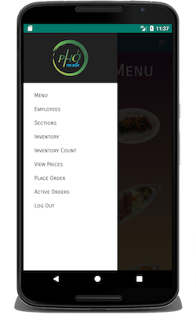

# About
A POS System that allows restaurant managers to store inventory information, employees and prices from various distributors. The POS System is merely an Android Java Application that uses REST API to communicate with the server and database. The android application offers restaurant managers to view employees, live-inventory, prices and notify users when inventory is low on stock.

The [rest-back-end](https://github.com/oiricaud/Inventory/tree/master/rest-back-end)
folder includes all of the back end code which communicates with the android application and database. You can drag this folder to your server. You can clone this project and open up android studio and import the project. 

        

# Motivation

I was not sure if I wanted to make this project open source but I realized that I can obtain feedback from other programmers. My goal is to create an API and make this repisotory generic as possible an offer this service to other restaurants. As technology is merging with the food industry it would be really cool to see the various food-trends based off locations.
